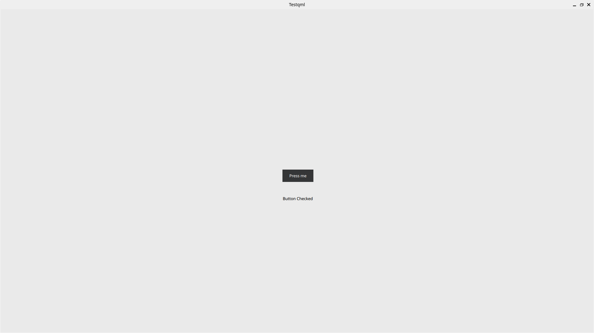
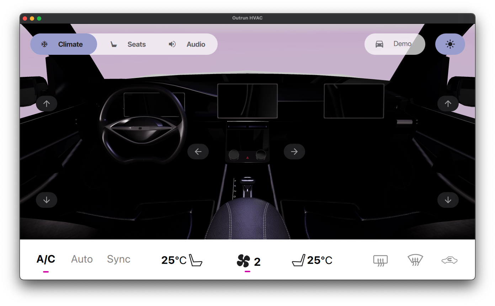

### Python project using qml, Qt Designer Studio

*Cannot use be from Qt Designer Studio in Python To use this tool, the following settings must be made*
## for linux
1. copy component studio
    ```bash
    cd pathQt/Tools/QtDesignStudio/qt6_design_studio_reduced_version/qml
    cp -r Studio/ /usr/lib/qt6/qml/QtQuick
    cd /usr/lib/qt6/qml/QtQuick
    chown -R user:group Studio/    
    ```
2. copy lib studio
    ```bash
    cd pathQt/Tools/QtDesignStudio/qt6_design_studio_reduced_version/lib
    cp libQt6QuickStudi* /usr/lib/
    ```

3. add code python to main
    ```python
     current_dir = os.path.dirname(os.path.realpath(__file__))
    os.environ["QT_QUICK_CONTROLS_CONF"] = os.path.join(
           current_dir, "Testqml", "qtquickcontrols2.conf"
       )
    os.environ["QT_AUTO_SCREEN_SCALE_FACTOR"] = "1"

    ## add addImportPath
    import_path = os.path.join(current_dir, "Testqml", "imports")
    import_path1 = os.path.join(current_dir, "Testqml", "content")
    engine.addImportPath(import_path )
    engine.addImportPath(import_path1 )
    print(engine.importPathList())
    qml_file = os.path.join(current_dir, "Testqml/content", "App.qml")
    engine.load(qml_file)

    ```

**use sampel project**
```bash
python main.py
```
## for MacOS
```python
# for mac os
engine.addImportPath("/Users/mbr/Qt/QtDesignStudio-4.1.1-lts/Qt Design Studio.app/Contents/Resources/qt6_design_studio_reduced_version/qml")
engine.addImportPath("/Users/mbr/Qt/6.8.2/macos/qml")
#####
```



